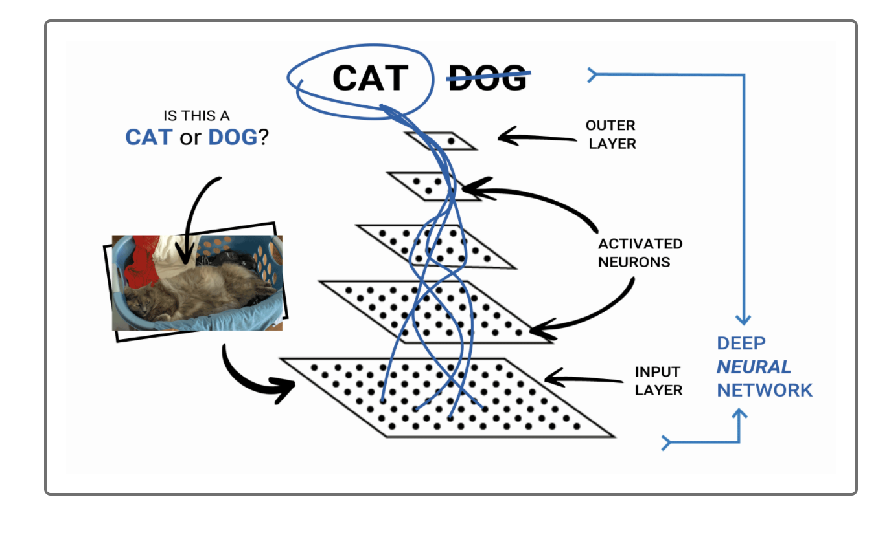
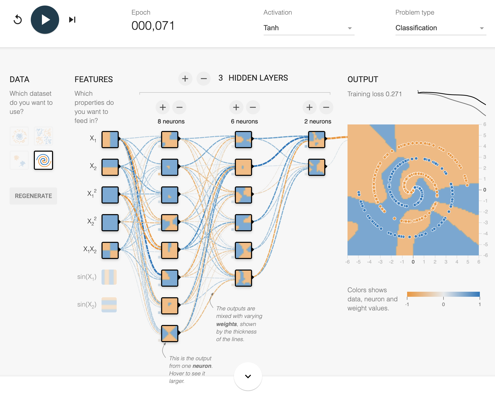
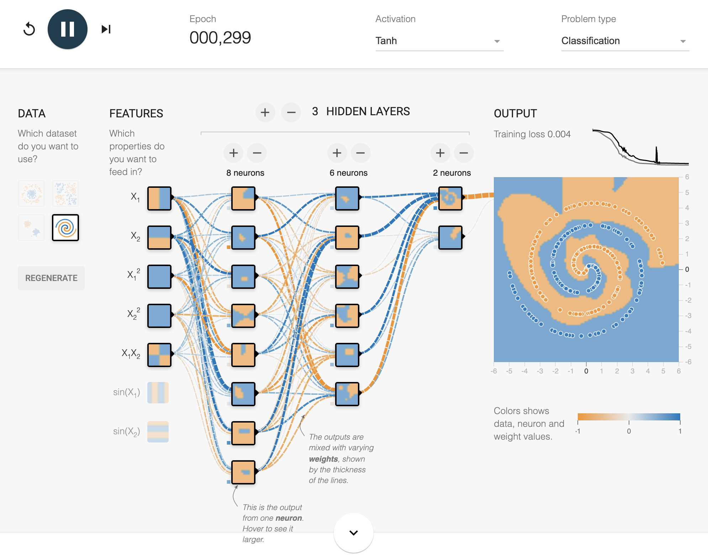
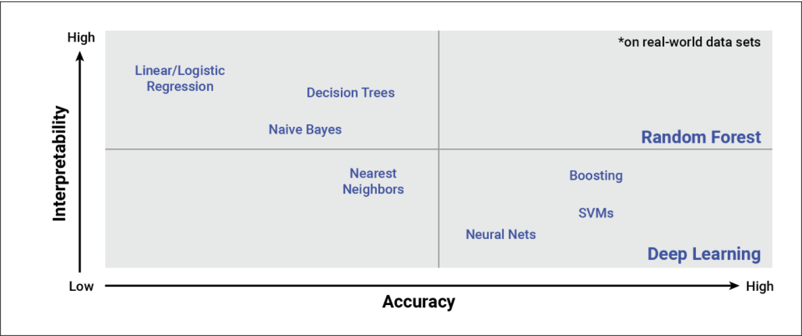

# Neural Networks Charity Analysis

## Project Overview :woman_technologist:

"Neural networks (also known as artificial neural networks, or ANN) are a set of algorithms that are modeled after the human brain. They are an advanced form of machine learning that recognizes patterns and features in input data and provides a clear quantitative output. In its simplest form, a neural network contains layers of neurons, which perform individual computations. These computations are connected and weighed against one another until the neurons reach the final layer, which returns a numerical result, or an encoded categorical result."
> Washington University in St. Louis, Data Analytics Bootcamp

Neural Networks


The project analyze the cost-effective of the several projects in a protfolio that raises funds and the foundation wants to predict where to make investments.
Machine Learning and Neural Networks become very handly because we use the features in the provided dataset in order to create a `binary classifier` that is capable of predicting whether applicants will be successful if funded by Alphabet Soup.

The data is analyzed through a CSV file that contains more than 34,000 organizations that have received funding from Alphabet Soup over the years. Within this dataset are a number of columns that capture metadata about each organization such as:

- EIN and NAME—Identification columns
- APPLICATION_TYPE—Alphabet Soup application type
- AFFILIATION—Affiliated sector of industry
- CLASSIFICATION—Government organization classification
- USE_CASE—Use case for funding
- ORGANIZATION—Organization type
- STATUS—Active status
- INCOME_AMT—Income classification
- SPECIAL_CONSIDERATIONS—Special consideration for application
- ASK_AMT—Funding amount requested
- IS_SUCCESSFUL—Was the money used effectively


## Resources

By using Anacanda and coding in Python, the project consists of three technical analyses where it is applyed statistical analysis and uses the following tools:

Data Source: charity_data.csv and AlphabetSoupCharity_Optimzation.h5
Data Tools: AlphabetSoupCharity.ipynb
Software: Python, Visual Studio Code, Anaconda, Jupyter Notebook and Pandas

Additionally, to understand the structure of a single neuron, it is necessary to dig into the concept `activation function`. 

```
The activation function is a mathematical function applied to the end of each "neuron" (or each individual perceptron model) that transforms the output to a quantitative value. This quantitative output is used as an input value for other layers in the neural network model.
```

During this project, it is studied the Deep neural network models also are commonly referred to as deep learning models due to their ability to learn from example data, regardless of the complexity or data input type. 
"Compared to basic neural network models, which require a large number of neurons to identify nonlinear characteristics, deep learning models only need a few neurons across a few hidden layers to identify the same nonlinear characteristics."
> Washington University in Saint Louis, Analytics Bootcamp

To conceptualize how performance differs between the basic neural network model versus a deep learning model, it is used the environment [TensorFlow](https://playground.tensorflow.org/#activation=tanh&batchSize=10&dataset=spiral&regDataset=reg-plane&learningRate=0.03&regularizationRate=0&noise=0&networkShape=8&seed=0.14370&showTestData=false&discretize=false&percTrainData=50&x=true&y=true&xTimesY=true&xSquared=true&ySquared=true&cosX=false&sinX=false&cosY=false&sinY=false&collectStats=false&problem=classification&initZero=false&hideText=false), where it is developed its playground application as a teaching tool to demystify the black box of neural networks and provide a working simulation of a neural network as it trains on a variety of different datasets and conditions.

the simulations in the TensorFlow Playground to better understand how altering the neurons and activation functions of a neural network can change its performance. See a couple of examples:

**Example 1**
Activation: Tahn
Epoch 071
Training Loss 0.271



**Example 2**
Activation: Tahn
Epoch 299
Training Loss 0.004



Looking at the performance of the last neural network, the metrics from the model shows that was able to correctly classify each of the points in the test data with a very minimal loss.


## Analysis and Challenges

The process of model -> fit -> predict/transform follows the same general steps across all of data science:

- Decide on a model, and create a model instance.
- Split into training and testing sets, and preprocess the data.
- Train/fit the training data to the model. (Note that "train" and "fit" are used interchangeably in Python libraries as well as the data field.)
- Use the model for predictions and transformations.

The main challenge running these types of algoriths is if the model is effective? well... the answer is...

"*Now that we are familiar with the structure and relative performance of a basic neural network and deep learning models, it is time to learn when and where to use these models. Contrary to what you may believe, neural networks are not the ultimate solution to all data science problems. As shown in the figure above, there are trade-offs to using the new and popular neural network (and deep learning) models over their older, often more lightweight statistics and machine learning counterparts. In this section, we'll discuss three popular regression/classification algorithms and compare them to a neural network alternative."

**Comparison Deep Learning vs other models**



## Summary

The model is optimized, and the predictive accuracy is increased to over 75%, or there is working code that makes three attempts to increase model performance using the following steps:

- Noisy variables are removed from features
- Additional neurons are added to hidden layers
- Additional hidden layers are added
- The activation function of hidden layers or output layers is changed for optimization
- The model's weights are saved every 5 epochs
- The results are saved to an HDF5 file
